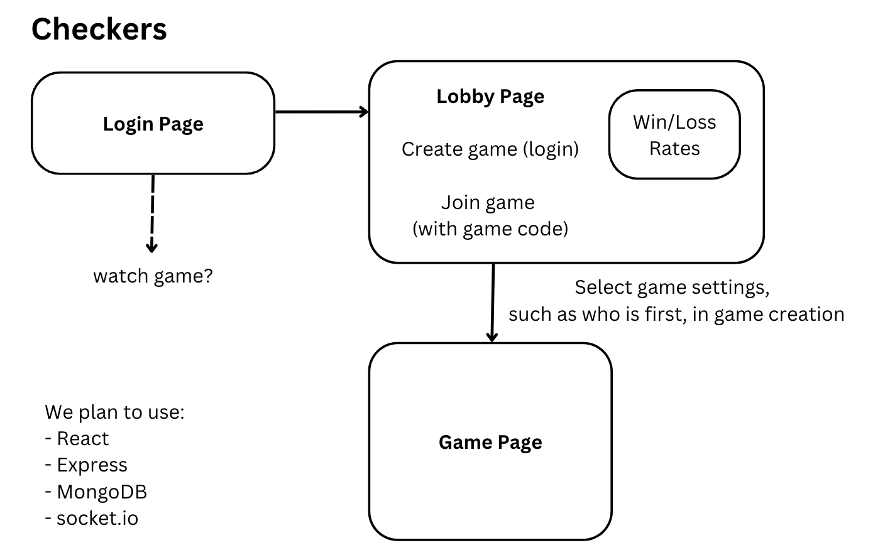

The project is a multiplayer online checkers game. The front-end will be written in React.js to make the game easier to display and update in real time. We will have three main pages. The first is a login page. The user must log in to proceed to the next page. The next page will be a game lobby browser-type page. A user has the choice of either creating a new game or joining an existing game. When a user creates a new game, they will be given a game code which they can share with a friend. If a user types in the game code for an active game, they will be put in that game against the person who made it. The networking for the game is server-based. Also on this page is a record of players’ wins and losses. When a player creates a game, they have the choice of whether they or the other player goes first, or they can have the server pick at random. Users can join games anonymously, but cannot create games without being logged in. Once they are in the game, it’s a normal game of checkers.
	
 We plan to use Socket.io to handle the networking during the game. This should give us the ability to have a client wait for the server to provide information about the opponent’s move. We will store the win/loss records in MongoDB, but the active game state will not be stored. This makes it so that if the server dies, any active games also die, which we have decided is a better option. 

